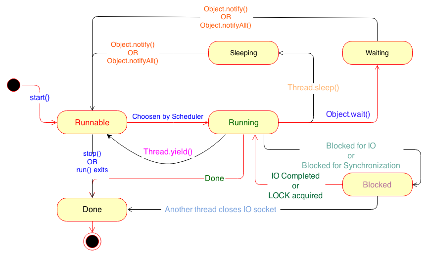

# Threats

##Links
- http://tutorials.jenkov.com/java-concurrency/creating-and-starting-threads.html
- http://winterbe.com/posts/2015/04/07/java8-concurrency-tutorial-thread-executor-examples/
- https://docs.oracle.com/javase/7/docs/api/java/lang/Thread.html
- http://www3.ntu.edu.sg/home/ehchua/programming/java/j5e_multithreading.html
